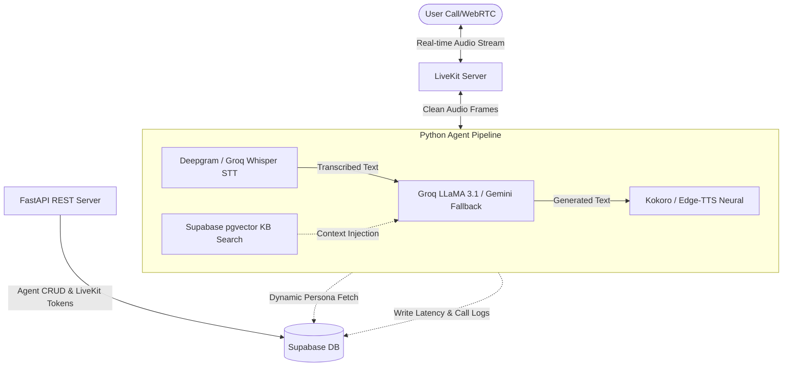

# 🎙️ VoiceAgent Studio

A production-grade platform to build, test, and deploy multilingual voice AI agents for real-world industries — Healthcare, Hospitality, HR-Tech, and Ed-Tech. 

This platform leverages WebRTC audio transport, real-time speech-to-text, low-latency LLMs with automatic fallback mechanisms, and native multilingual text-to-speech.

---

## 🏗️ Architecture



---

## 🌟 Key Features

* **⚡ Real-time Audio Transport:** Powered by WebRTC and Silero VAD (Voice Activity Detection) via LiveKit, enabling seamless barge-in support.
* **🌐 Multilingual Voice Pipeline:** Out-of-the-box support for **English**, **Hindi**, and **Tamil** speech-to-text transcription and text-to-speech.
* **🧠 LLM Resiliency Chain:** Orchestrates Groq LLaMA 3.1 8B with automatic transparent fallback to Gemini 1.5 Flash if rate limits are hit.
* **📂 PDF/TXT Knowledge Bases (RAG):** Upload PDFs or text files to dynamically inject semantic context into calls using Supabase `pgvector` and local SentenceTransformer embeddings.
* **💾 Redis Session & History Management:** Retains conversation state and call context using Upstash Redis with automated TTL cleanup.
* **🛠️ Dynamic Agent Builder:** A React dashboard where you can build, configure, and customize personas, toggle tools, upload knowledge bases, and initiate live WebRTC calls.

---

## 🛠️ Technology Stack

| Layer | Component / Provider | Cost |
| :--- | :--- | :--- |
| **Audio Transport** | LiveKit (Self-Hosted or Cloud) | Free Tier |
| **Speech-to-Text** | Deepgram Nova-2 (Primary) / Groq Whisper (Fallback) | $200 Free Credit / Free Tier |
| **Language Model** | Groq LLaMA 3.1 8B (Primary) / Gemini 1.5 Flash (Fallback) | Free Tier |
| **Text-to-Speech** | Kokoro (Local English) / Edge-TTS (Microsoft Neural Hindi & Tamil) | 100% Free / Local |
| **VAD** | Silero VAD | Free |
| **Database** | Supabase (PostgreSQL + pgvector) | Free Tier |
| **Session Cache** | Upstash Redis | Free Tier |
| **Embeddings** | sentence-transformers/all-MiniLM-L6-v2 (Local) | Free |

---

## 👥 Demo Agents

The project comes pre-configured with four demo agents running side-by-side:
* **Priya (English):** Healthcare receptionist at Apollo Hospitals Chennai.
* **Priya (Hindi):** Healthcare receptionist speaking and transcribing native Hindi.
* **Arjun (English):** Concierge at The Leela Palace Chennai.
* **Arjun (Tamil):** Hotel concierge speaking and transcribing native Tamil.

---

## 🚀 Quick Start Guide

### 1. Clone & Configure Environment
Clone the repository and copy the environment template:
```bash
git clone https://github.com/yourusername/voiceagent-studio.git
cd voiceagent-studio
cp .env.example .env
```
Fill in the credentials in your `.env` file:
* **LiveKit:** Generate credentials at [LiveKit Cloud](https://cloud.livekit.io) or run a local instance.
* **Deepgram:** Sign up at [Deepgram Console](https://console.deepgram.com) for STT.
* **Groq:** Get an API key at [Groq Console](https://console.groq.com).
* **Supabase & Redis:** Set up your database and memory cache keys.

### 2. Set Up Supabase Database
Run the schema setup script located at `infra/supabase_schema.sql` inside your Supabase SQL Editor. This will:
1. Enable the `vector` extension.
2. Create the `agents`, `knowledge_chunks`, and `call_logs` tables.
3. Establish database RLS (Row Level Security) and indices.

### 3. Running with Docker (Recommended)
This starts the LiveKit server, the FastAPI backend rest server, and the Python voice agent worker:
```bash
docker-compose up --build
```

### 4. Running the Frontend Dashboard
Navigate to the frontend folder, install dependencies, and spin up the developer server:
```bash
cd frontend
npm install
npm run dev
```
Open [http://localhost:5173](http://localhost:5173) in your browser.

---

## ⚙️ How Multilingual Speech Works

To provide natural language switching without latency overhead, VoiceAgent Studio dynamically configures its pipeline according to the agent's target language:

### Speech-to-Text (STT) Configuration
In `agent/main.py`, the worker inspects the agent's primary language and requests localized speech models:
```python
# Deepgram BCP-47 mappings for high-accuracy transcribing
dg_lang_map = {
    "en": "en-US",
    "hi": "hi-IN",
    "ta": "ta-IN",
}
```

### Text-to-Speech (TTS) Configuration
* **English:** Uses **Kokoro TTS** locally for ultra-realistic human speech synthesis.
* **Hindi & Tamil:** Falls back to **Edge-TTS** to leverage Microsoft's free Neural voice libraries:
  * Hindi Voice: `hi-IN-SwaraNeural`
  * Tamil Voice: `ta-IN-PallaviNeural`

---

## 📁 Project Structure

```
voiceagent-studio/
├── agent/                  # Python LiveKit-Agent worker process
│   ├── main.py             # Main pipeline entrypoint (STT, LLM, VAD, TTS)
│   ├── core/               # Configuration, logging, session history
│   ├── personas/           # AgentPersona schema & hardcoded demo models
│   ├── rag/                # Supabase vector database search and ingestion
│   └── tts_plugins.py      # Custom TTS integrations (Kokoro, Edge-TTS)
├── api/                    # FastAPI backend REST API
│   ├── main.py             # Server configuration & CORS
│   └── routers/            # Routes (agents CRUD, call log analytics, token issue)
├── frontend/               # React (Vite + TailwindCSS + Lucide Icons)
│   └── src/
│       ├── components/     # UI components (AgentBuilder, CallView, Transcript)
│       └── pages/          # Pages (Dashboard, CallPage, BuilderPage)
└── infra/
    └── supabase_schema.sql # Database DDL, pgvector schemas, and index creations
```

---

## 🔒 Security & Best Practices
* **Token Auths:** Connection keys are generated on the server using S2S JSON Web Tokens. LiveKit API secrets are never exposed to the client.
* **Row-Level Security:** Supabase tables require `service_role` authorization headers.
* **Sanitized Inputs:** System prompts are validated using Pydantic sanitizers to prevent jailbreak patterns.
